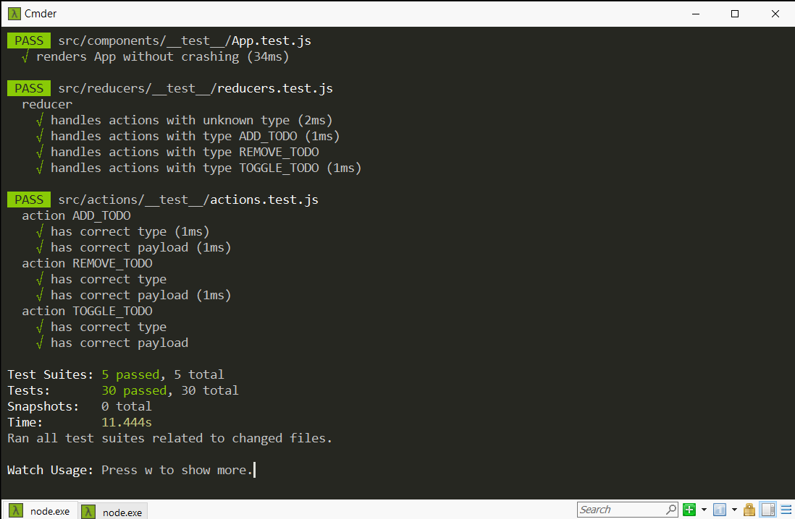

# 代辦事項清單  
[Demo](https://shinenic.github.io/todo-list-for-test/)

主要為練習 React 單元測試，

並有簡易功能之代辦事項清單 Side Project。

# 功能

* 新增 todo
* 修改 todo 狀態 (完成 / 未完成)
* 移除 todo
* 切換檢視模式 (代辦事項 / 已完成事項 / 全部)

# 使用技術

* React
* Redux
* Jest 搭配 enzyme 進行 unit test
* SCSS

# 測試結果

## `npm start` 執行畫面

## `npm test` 測試輸出

## `npm test -- --verbose` 詳細單元測試清單

## `npm test -- --coverage` 測試覆蓋率

